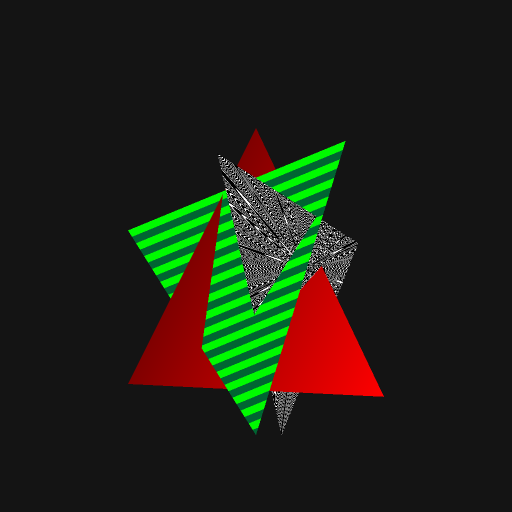

# Raytrace renderer

A hobby project that renders 3D shapes onto an HTML canvas without using WebGL. I used this to
try out TypeScript.

## Screenshot



## installation

``` bash
npm install -g typescript browserify

git clone https://github.com/andrezsanchez/raytrace-ts.git
cd raytrace-ts
npm install
make

# serve the local directory somehow
http-server .
```

## license

MIT
